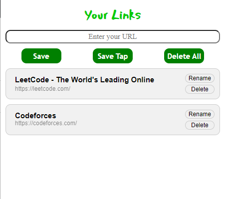

# Your-Links-extension
<p align = "center">
  
</p>

Your-Links is a Chrome extension that allows you to save your favorite links and taps in a simple and easy way.

## Installation

- First clone the repository
    
    ```bash
    git clone https://github.com/efraimnabil/Your-Links-extension.git
    ```

- Then open the extension page in chrome by typing `chrome://extensions/` in the address bar.

- Enable the developer mode in the top right corner.

- Click on `Load unpacked` and select the folder of the project.

- Now you can use the extension.

## Usage

Click on the extension icon to open the extension

- Type a link and click `Save` to save it.

- Click on `Save Tap` to save the current tab.

- Click on `Delete All` to delete all the saved links.

- Click on `Delete` to delete a specific link.

- Click on `rename` to rename a specific link.